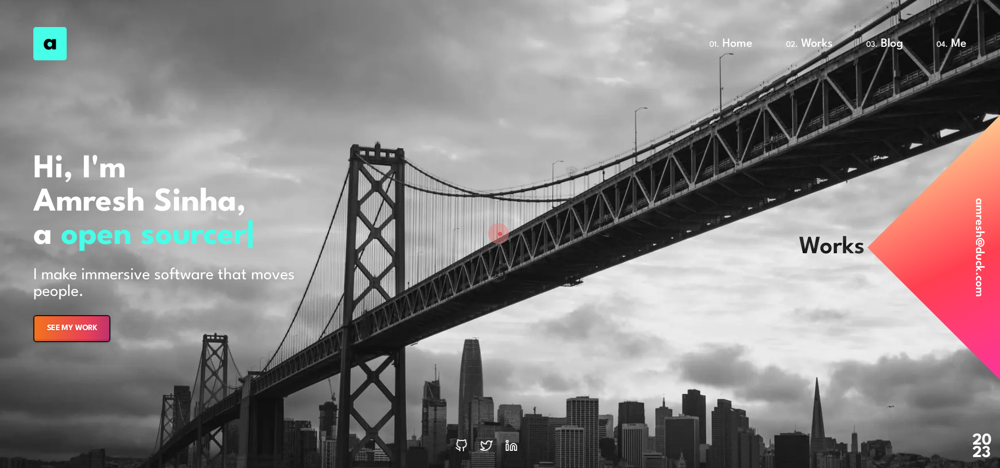

<h1 align="center">Wink :sparkles:<br /><a href="https://AmreshSinha.vercel.app" target="_blank">AmreshSinha</a></h1>



## Notes :heavy_exclamation_mark:

- About Me Page - WIP (Ignore the current one)
- Works Page - More feature will be added

## Weapons used (ง •̀_•́)ง

- React.js
- Styled-Component
- Three.js (Will be used in About me page)
- Lenis (for smooth scrolling, will be added)

## Deploying ♡(ŐωŐ人)

I know you are here for this section only. Let's not waste more time. Just before going any further, please first Star :star2: the repository. It would help me a lot. Thanks!

### Common prep before deploying

1) Fork the Repo (Do star it too :)
2) Edit the Home Page `src/pages/Home/index.js` and for the Works Page edit the `config.json` file `src/config.json`
3) Edit the Navbar Logo Initial `src/components/DesktopNav` . (Ps. Lower case is better)

### Deploy to a PaaS
You are mostly done. Choose the platform for deploying:
  - [Vercel](https://vercel.com)
  - [Netlify](https://www.netlify.com)
  - [Railway](https://railway.app)
  - [Render](https://render.com)
  - [Cyclic](https://www.cyclic.sh)
  - etc

### Deploying on your own Server (For **Hardcore Privacy Focused User**)

This is not covering any of the DNS stuff. I have already provided provided minimal config files for deploying manually on server. (Docker configs)

Do note that the docker pathway assumes that you have **Traefik** running. If you want to use any other reverse-proxy you will have to edit the config files on your own. Do create a PR if you add support for any other reverse-proxy service.

<h2> Development (*ˊᗜˋ*)/ᵗᑋᵃᐢᵏ ᵞᵒᵘ*</h2>

You already know how to setup the dev environment.<br />It's just a normal React App ( ˘▽˘)っ♨

Anyways, make sure your node version is 18.x and yarn is the latest stable version.

### Install Deps

```bash
yarn install
```

### Start the Development Environment

```bash
yarn start
```

As easy as that ٩(＾◡＾)۶

## PR Guidelines (づ ◕‿◕ )づ

### Branch naming

`TYPE-ISSUE_ID-DESCRIPTION`

`TYPE`:
- `feat` - a new feature
- `doc` - documentation only changes
- `cicd` - changes related to CI/CD system
- `fix` - a bug fix
- `refactor` - code change that neither fixes a bug nor adds a feature

`ISSUE_ID`: Github Issue ID

`DESCRIPTION`: A small description which explains what changes you have done

Make sure the target branch is `dev-react`

## What else? (◔ヘ◔)

Nothing. Here have a pizza slice 🍕.

## Boring stuff

[LICENSE](./LICENSE) - GNU GPL v3.0

## Contributors

<a href="https://github.com/AmreshSinha/wink/graphs/contributors">
  
</a>
